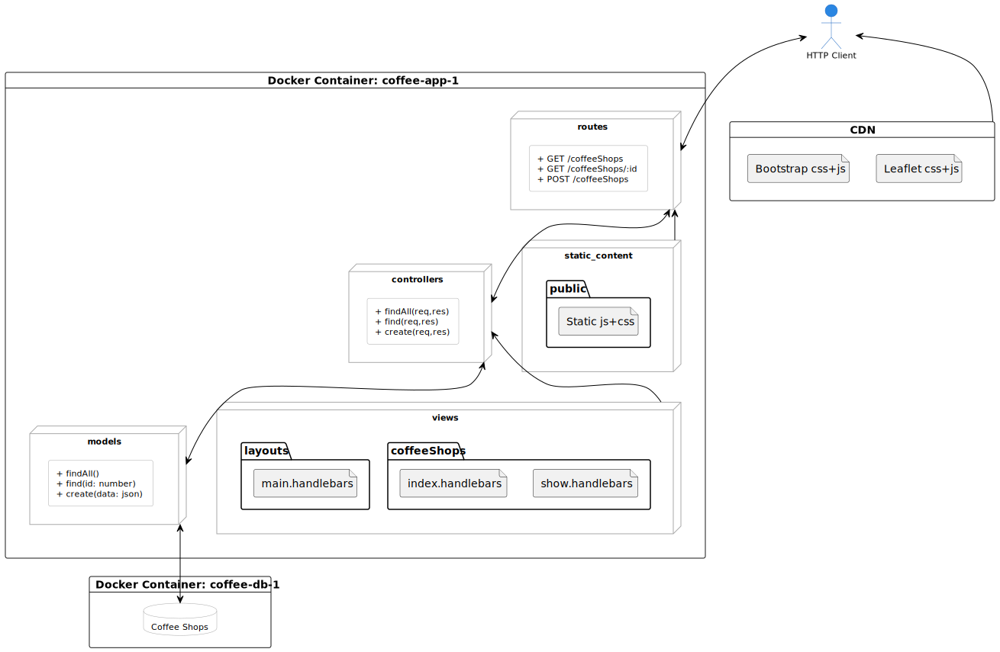

# IADE - Universidade Europeia
## Sistemas de Informação Geográficos

Projeto de exemplo para Sistemas de Informação Geográficos, com integração de NodeJS, Express, PostgresSQL/Postgis e Leaflet.

O exemplo consiste numa aplicação que permite a interação com uma base de dados de cafés, com a possibilidade de visualização dos mesmos num mapa.

A arquitetura é a seguinte:



| Verbo HTTP | URL           | Descrição              |
|------------|---------------|------------------------|
| GET | /coffee-shops | Listagem de registos.  |
| GET | /coffee-shops/:id | Detalhe de um registo. |
| POST | /coffee-shops | Criação de um registo. |    

### Instruções

O projeto está distribuído num docker-compose, pelo que para correr o projeto basta executar o seguinte comando:

```bash
docker-compose up
```

### Exemplos de utilização

A consulta dos dados pode ser feita através de um cliente HTTP qualquer. As respostas podem ser em JSON ou HTML, dependendo do cabeçalho Accept.

Com o curl:

```bash
curl -X GET http://localhost:3000/coffee-shops
curl -X GET -H 'Accept: application/json' localhost:3000/coffee-shops
curl -X GET -H 'Accept: text/html' localhost:3000/coffee-shops/20
curl -X GET -H 'Accept: application/json' localhost:3000/coffee-shops/20
```

Um novo registo deve ser efetuado através de um POST com payload no formato de um formulário HTML. Por exemplo:

```bash
curl -X POST -d 'name=Bar+IADE&categoy=Cafe&address=Avenida+D.+Carlos+I,+nº+4+1200-649+Lisboa,+Portugal&rating=4&num_reviews=1&lon=38.70737564461885&lat=-9.152443432254032' localhost:3000/coffee-shops
```


